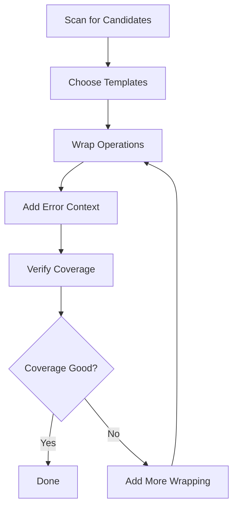

# Add Debug Wrapping

Systematic approach to adding debug wrapping to existing code

## Overview

This command provides a step-by-step workflow for add debug wrapping.
Each step includes detailed instructions, code examples, and best practices.

## Workflow Diagram



## Implementation Steps

### Step 1: Identify Debug Candidates

Scan codebase for async operations that need debug tracking

```bash
// Use built-in analysis to find unwrapped operations
npx ai-debug analyze --find-async
npx ai-debug suggest --priority=high
```

**Notes:**

- Focus on critical business logic first
- Prioritize external integrations and database operations
- Look for error-prone or performance-sensitive code

### Step 2: Choose Appropriate Templates

Select the most specific template for each operation type

```bash
// Template selection guide:
// HTTP/API calls → 'http'
// Database queries → 'database'  
// File operations → 'file'
// Queue operations → 'queue'
// Business logic → 'business'
// Unknown objects → 'auto'
```

**Notes:**

- Use most specific template available
- Avoid defaulting to base template
- Create custom templates for domain-specific patterns

### Step 3: Wrap Async Operations

Apply debug wrapping with proper context and error handling

```json
// Before: Unwrapped async operation
const user = await userService.findById(userId);

// After: Wrapped with debug tracking
/*DEBUG:START*/
const user = await debug.wrap('fetch_user_by_id', async () => {
  return await userService.findById(userId);
}, {
  template: 'database',
  context: {
    operation: 'findById',
    table: 'users',
    userId: userId
  }
});
/*DEBUG:END*/
```

**Notes:**

- Use descriptive action names that indicate purpose
- Include relevant context for debugging
- Wrap the minimal necessary scope

### Step 4: Add Error Context

Enhance error handling with debug context

```json
/*DEBUG:START*/
try {
  const result = await debug.wrap('process_payment', async () => {
    return await paymentGateway.charge(amount, cardToken);
  }, {
    template: 'http',
    context: {
      amount: amount,
      gateway: 'stripe',
      operation: 'charge'
    }
  });
} catch (error) {
  // Debug data automatically captured for failed operations
  logger.error('Payment processing failed', { 
    amount, 
    error: error.message,
    debugAction: 'process_payment'
  });
  throw error;
}
/*DEBUG:END*/
```

**Notes:**

- Debug system automatically captures error context
- Failed operations are tracked separately
- Include action name in error logs for correlation

### Step 5: Verify Debug Coverage

Check that debug wrapping is working correctly

```bash
// Verify debug data is being captured
npx ai-debug list --recent=10
npx ai-debug view process_payment

// Check coverage metrics
npx ai-debug coverage --show-details
npx ai-debug stats --group-by=template
```

**Notes:**

- Test wrapped operations to ensure data capture
- Verify context data is meaningful
- Check that templates are being applied correctly

## Examples

### HTTP API Integration

Wrap external API calls with proper context

**Context:** External service integration with authentication

```typescript
/*DEBUG:START*/
const orderStatus = await debug.wrap('check_order_status', async () => {
  const response = await fetch(`${apiBase}/orders/${orderId}/status`, {
    headers: { 'Authorization': `Bearer ${token}` }
  });
  return await response.json();
}, {
  template: 'http',
  context: {
    url: `${apiBase}/orders/${orderId}/status`,
    method: 'GET',
    orderId: orderId,
    service: 'order-service'
  }
});
/*DEBUG:END*/
```

### Complex Business Logic

Wrap business operations with domain context

**Context:** Complex calculation with multiple factors

```typescript
/*DEBUG:START*/
const pricingResult = await debug.wrap('calculate_dynamic_pricing', async () => {
  const basePrice = await pricing.getBasePrice(productId);
  const discounts = await pricing.getApplicableDiscounts(customerId);
  const surge = await pricing.getSurgeMultiplier(location, time);
  
  return pricing.calculateFinalPrice(basePrice, discounts, surge);
}, {
  template: 'business',
  context: {
    operation: 'dynamic_pricing',
    productId,
    customerId,
    location,
    factors: ['base', 'discounts', 'surge']
  }
});
/*DEBUG:END*/
```

## Project-Specific Examples

### DebugContext - Example 1

From: `types/index.ts:37`

```typescript
const context: DebugContext = {
  action: 'fetch_user',
  url: '/api/users/123',
  method: 'GET',
  headers: { 'Authorization': 'Bearer token' }
};
```

### DebugResult - Example 1

From: `types/index.ts:87`

```typescript
const result: DebugResult = {
  data: { id: 123, name: 'John' },
  status: 200,
  headers: { 'content-type': 'application/json' }
};
```

## Best Practices

- Wrap at the right granularity - not too fine, not too coarse
- Use action names that describe business intent, not technical implementation
- Include context that would help diagnose issues
- Focus on async operations and external dependencies first
- Test debug wrapping in development before deploying

## Troubleshooting

- Debug data not appearing: Check if NODE_ENV=production is removing debug code
- Wrong template applied: Verify template selection logic
- Context data missing: Ensure context objects are serializable
- Performance impact: Review wrapping granularity and reduce if needed

---

*Generated for @dkmaker/ai-debug v0.1.0*