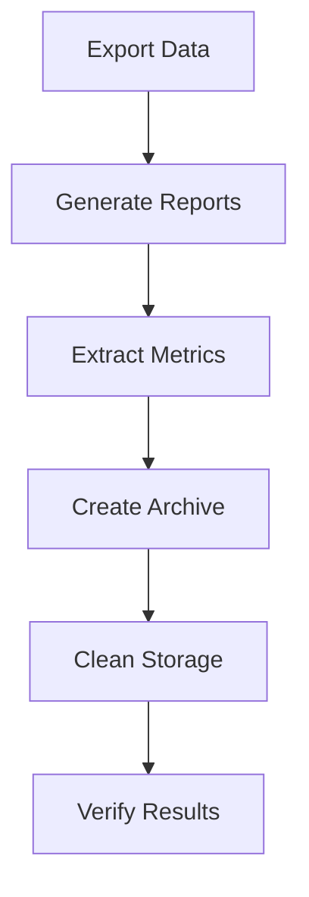

# Extract All Debug Data

Comprehensive workflow for extracting and analyzing all debug data

## Overview

This command provides a step-by-step workflow for extract all debug data.
Each step includes detailed instructions, code examples, and best practices.

## Workflow Diagram



## Implementation Steps

### Step 1: Export Debug Data

Extract all debug data in various formats for analysis

```bash
// Export all debug data
npx ai-debug export --format=json --output=debug-export.json

// Export with filters
npx ai-debug export --format=csv --filter="status=failure" --output=failures.csv
npx ai-debug export --format=json --since="2024-01-01" --template=http
```

**Notes:**

- JSON format preserves full data structure
- CSV format is good for spreadsheet analysis
- Use filters to focus on specific subsets

### Step 2: Generate Analysis Reports

Create comprehensive analysis of debug patterns and performance

```bash
// Generate detailed analysis reports
npx ai-debug analyze --full-report --output=analysis-report.md
npx ai-debug coverage --detailed --output=coverage-report.html
npx ai-debug stats --comprehensive --format=json --output=stats.json
```

**Notes:**

- Full reports include patterns, anti-patterns, and suggestions
- Coverage reports show debug wrapping effectiveness
- Stats provide quantitative metrics

### Step 3: Extract Performance Metrics

Analyze performance data and identify bottlenecks

```bash
// Performance-focused extraction
npx ai-debug export --metrics-only --format=json --output=metrics.json

// Find slow operations
npx ai-debug list --sort-by=duration --limit=20 --format=table

// Analyze cache effectiveness
npx ai-debug stats --cache-analysis --output=cache-report.json
```

**Notes:**

- Metrics include duration, cache hits, error rates
- Sort by duration to find performance bottlenecks
- Cache analysis shows optimization opportunities

### Step 4: Create Data Archive

Archive debug data with proper organization and compression

```bash
// Create organized archive
mkdir -p debug-archive/$(date +%Y-%m-%d)
npx ai-debug export --format=json --compress --output=debug-archive/$(date +%Y-%m-%d)/full-export.json.gz

// Export by template for organized analysis
npx ai-debug export --template=http --output=debug-archive/$(date +%Y-%m-%d)/http-operations.json
npx ai-debug export --template=database --output=debug-archive/$(date +%Y-%m-%d)/database-operations.json
```

**Notes:**

- Organize archives by date for historical analysis
- Use compression for large datasets
- Separate by template for focused analysis

### Step 5: Clean Up Debug Storage

Safely clean up debug storage after extraction

```bash
// Backup current debug data
npx ai-debug export --format=json --output=backup-$(date +%Y%m%d).json

// Clean up old debug entries (keep last 30 days)
npx ai-debug cleanup --older-than=30d --dry-run
npx ai-debug cleanup --older-than=30d --confirm

// Verify cleanup
npx ai-debug stats --storage-info
```

**Notes:**

- Always backup before cleanup
- Use dry-run to preview what will be deleted
- Monitor storage usage after cleanup

## Examples

### Complete Data Export

Export all debug data with comprehensive filtering

**Context:** Automated export script for regular data extraction

```bash
#!/bin/bash
# Complete debug data extraction script

DATE=$(date +%Y-%m-%d)
EXPORT_DIR="debug-exports/$DATE"
mkdir -p "$EXPORT_DIR"

# Export all data
npx ai-debug export --format=json --output="$EXPORT_DIR/complete-export.json"

# Export by status
npx ai-debug export --filter="status=success" --output="$EXPORT_DIR/successful-operations.json"
npx ai-debug export --filter="status=failure" --output="$EXPORT_DIR/failed-operations.json"

# Export by template
for template in http database file queue business; do
  npx ai-debug export --template="$template" --output="$EXPORT_DIR/$template-operations.json"
done

# Generate reports
npx ai-debug analyze --output="$EXPORT_DIR/analysis-report.md"
npx ai-debug coverage --output="$EXPORT_DIR/coverage-report.html"

echo "Export complete: $EXPORT_DIR"
```

### Performance Analysis Export

Focus on performance metrics and slow operations

**Context:** Programmatic export for automated analysis

```typescript
// Export slow operations for analysis
const slowOps = await debug.export({
  filter: { minDuration: 1000 }, // Operations > 1 second
  format: 'json',
  includeContext: true,
  sortBy: 'duration',
  limit: 100
});

// Export cache statistics
const cacheStats = await debug.export({
  type: 'cache-stats',
  format: 'json',
  groupBy: 'template',
  includeHitRates: true
});

// Export error patterns
const errorPatterns = await debug.export({
  filter: { status: 'failure' },
  format: 'json',
  groupBy: ['template', 'errorType'],
  includeStackTraces: false // For privacy
});
```

## Project-Specific Examples

### DebugContext - Example 1

From: `types/index.ts:37`

```typescript
const context: DebugContext = {
  action: 'fetch_user',
  url: '/api/users/123',
  method: 'GET',
  headers: { 'Authorization': 'Bearer token' }
};
```

### DebugResult - Example 1

From: `types/index.ts:87`

```typescript
const result: DebugResult = {
  data: { id: 123, name: 'John' },
  status: 200,
  headers: { 'content-type': 'application/json' }
};
```

## Best Practices

- Export regularly to prevent data loss
- Use filters to focus analysis on specific issues
- Organize exports by date and purpose
- Compress large exports to save storage
- Always backup before cleaning up debug data

## Troubleshooting

- Export fails: Check disk space and file permissions
- Large exports timeout: Use filters to reduce data size
- Missing data in exports: Verify date ranges and filters
- Corrupted exports: Check debug data integrity before export

---

*Generated for @dkmaker/ai-debug v0.1.0*