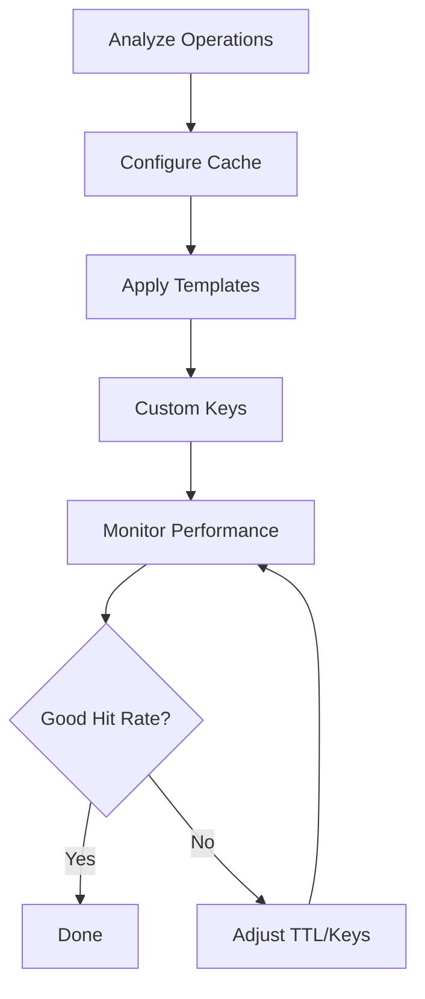

# Implement Caching Strategy

Step-by-step workflow for implementing caching with AI Debug system

## Overview

This command provides a step-by-step workflow for implement caching strategy.
Each step includes detailed instructions, code examples, and best practices.

## Workflow Diagram



## Implementation Steps

### Step 1: Analyze Caching Requirements

Identify operations that would benefit from caching

```bash
// Analyze current debug data for cache opportunities
npx ai-debug analyze --focus=performance
npx ai-debug stats --group-by=template
```

**Notes:**

- Look for repeated operations with similar inputs
- Focus on expensive operations (database, HTTP, file I/O)
- Consider data volatility and TTL requirements

### Step 2: Configure Cache Settings

Set up cache configuration in .ai-debug/config.json

```json
{
  "features": {
    "cache": {
      "enabled": true,
      "strategy": "lru",
      "maxSize": 100,
      "defaultTTL": 300000,
      "compression": true
    }
  }
}
```

**Notes:**

- Choose LRU for memory efficiency or FIFO for predictable behavior
- Set maxSize based on available memory
- Use compression for large cached objects

### Step 3: Implement Template-Based Caching

Apply caching to operations using appropriate templates

```json
// HTTP operations with intelligent caching
/*DEBUG:START*/
const userData = await debug.wrap('fetch_user_profile', async () => {
  return await apiClient.get(`/users/${userId}`);
}, { 
  template: 'http',
  context: { 
    url: `/users/${userId}`,
    method: 'GET',
    cacheable: true
  }
});
/*DEBUG:END*/
```

**Notes:**

- HTTP template automatically caches GET requests
- Database template caches SELECT queries
- Use context.cacheable for explicit control

### Step 4: Customize Cache Keys

Create custom cache key strategies for complex scenarios

```json
// Custom cache key for personalized data
/*DEBUG:START*/
const recommendations = await debug.wrap('user_recommendations', async () => {
  return await ml.getRecommendations(userId, preferences);
}, {
  template: 'business',
  cache: {
    key: (ctx) => `recs:${ctx.userId}:${hashObject(ctx.preferences)}`,
    ttl: 15 * 60 * 1000, // 15 minutes
    shouldCache: (result) => result.length > 0
  }
});
/*DEBUG:END*/
```

**Notes:**

- Include user context in cache keys for personalized data
- Use content hashing for complex input objects
- Set conditional caching based on result quality

### Step 5: Monitor Cache Performance

Track cache hit rates and optimize configuration

```bash
// Monitor cache effectiveness
npx ai-debug stats --cache-metrics
npx ai-debug view --cache-analysis

// Export cache data for analysis
npx ai-debug export --format=json --include=cache-stats
```

**Notes:**

- Aim for 60-80% cache hit rate for read operations
- Monitor memory usage and adjust maxSize if needed
- Review TTL settings based on data freshness requirements

## Examples

### Database Query Caching

Cache expensive database queries with automatic key generation

**Context:** Database template automatically generates cache keys based on SQL and parameters

```typescript
/*DEBUG:START*/
const products = await debug.wrap('fetch_active_products', async () => {
  return await db.query(
    'SELECT * FROM products WHERE active = ? ORDER BY created_at DESC',
    [true]
  );
}, { 
  template: 'database',
  context: { 
    table: 'products',
    operation: 'SELECT',
    filters: { active: true }
  }
  // Cache automatically enabled for SELECT queries
});
/*DEBUG:END*/
```

### API Response Caching

Cache external API responses with custom TTL

**Context:** Weather data changes frequently, so use shorter TTL

```typescript
/*DEBUG:START*/
const weatherData = await debug.wrap('fetch_weather', async () => {
  return await weatherAPI.getCurrentWeather(city);
}, {
  template: 'http',
  context: {
    url: `/weather/${city}`,
    method: 'GET'
  },
  cache: {
    ttl: 10 * 60 * 1000 // 10 minutes for weather data
  }
});
/*DEBUG:END*/
```

## Project-Specific Examples

### CacheMetadata - Example 1

From: `types/index.ts:174`

```typescript
const metadata: CacheMetadata = {
  entries: {
    'a1b2c3d4': {
      context: { method: 'GET', url: '/api/users' },
      created: '2024-01-01T12:00:00.000Z',
      lastAccessed: '2024-01-01T12:05:00.000Z',
      hitCount: 5,
      size: 2048,
      ttl: 300000,
      expired: false
    }
  },
  stats: {
    totalHits: 100,
    totalMisses: 20,
    totalSize: 51200
  }
};
```

## Best Practices

- Always use template-based caching for consistency
- Include user/tenant context in cache keys for multi-tenant apps
- Set TTL based on data volatility, not arbitrary timeouts
- Use conditional caching to avoid storing empty or error results
- Monitor cache hit rates and adjust strategies accordingly

## Troubleshooting

- Low cache hit rate: Check if cache keys are too specific or TTL too short
- Memory issues: Reduce maxSize or enable compression
- Stale data: Implement cache invalidation or reduce TTL
- Cache misses on similar data: Review cache key generation logic

---

*Generated for @dkmaker/ai-debug v0.1.0*